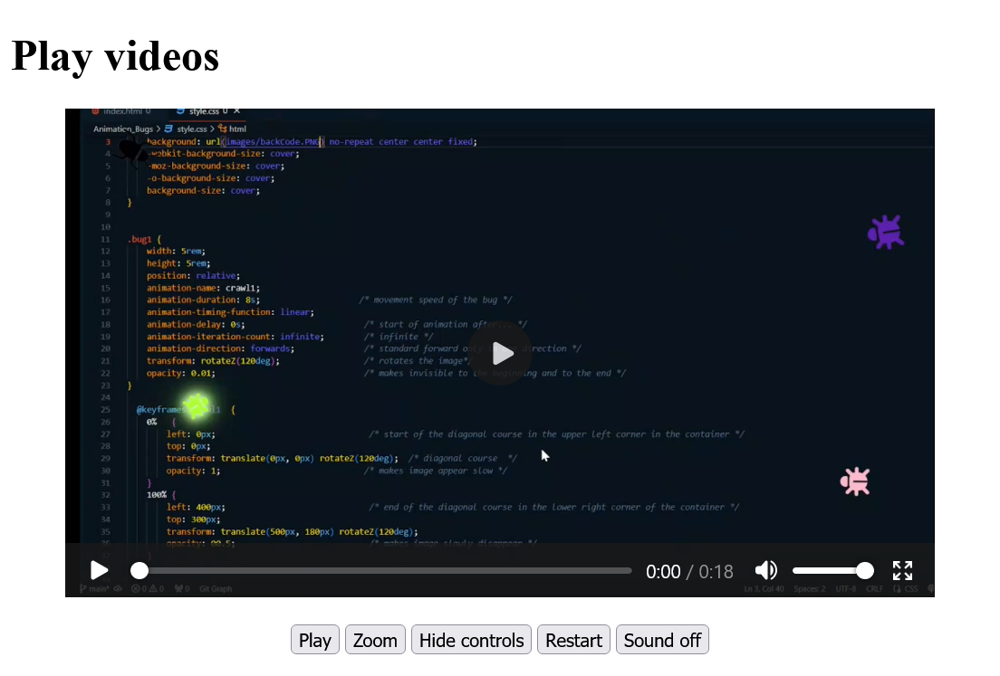

# JavaScript_Introduction-To-Web-APIs

 Introduction to Web APIs: Video and Audio API, Canvas 2D API, Geolocation API, Drag & Drop API, Offline Data, Web Workers, Server-Sent Events...

---------------------------------------------

## Content
 1. Video and audio media API
    - 1.1. Controlling video files with JavaScript and the Media API
    - 1.2. Controlling audio files with JavaScript and the Media API
 2. The Canvas 2D API
    - 2.1. Drawing on a `<canvas>` element
    - 2.2. Methods used to draw on the `<canvas>` element
    - 2.3. Copy and manipulate images with `<canvas>`
    - 2.4. Create your own functions (*wrapper*) for `<canvas>`
    - 2.5. Extending the *CanvasRenderingContext2D*

---------------------------------------------

# 1. Video and audio media API
Playing video and audio files is possible in HTML5 with the `<video>` and `<audio>` elements. The appearance of the controls (play, pause, volume, etc.) are predefined by the web browser and cannot be changed. But it is also possible to control media files using the JavaScript API. The advantage of custom controls for playing media files using the Media API is that the design and functionality of the player can be determined by the user and the controls can be styled using CSS or graphics.

The Media API provides a fairly large set of properties and methods. Furthermore, many event types are available, which can be used to react accordingly. 

A complete overview of all media events can be found here [HTML - Living Standard](https://html.spec.whatwg.org/multipage/media.html#mediaevents).


## 1.1. Controlling video files with JavaScript and the Media API

Example:

  [Complete Code](https://github.com/BellaMrx/JavaScript_Introduction-To-Web-APIs/tree/main/Examples/Part_1) --> **Examples/Part_1/...** 

index.html:
   ```
    <div class="video_canvas">
        <video width="640">
            <source src="video/Bugs.webm" type="video/webm">
            <source src="video/Bugs.mp4" type="video/mp4">
            Your web browser does not support video tag.
        </video>
        <p>
            <button onclick="playVideo()" id="play">Play</button>
            <button onclick="resize()" id="size">Zoom</button>
            <button onclick="control()" id="ctrl">Display controls</button>
            <button onclick="restart()">Restart</button>
            <button onclick="mute()" id="mute">Sound off</button>
        </p>
    </div>
   ```

script.js:
   ```
    let vid = document.querySelector('video');

    function playVideo() {
      let but = document.querySelector('#play');
      if (vid.paused) {
        vid.play();
        but.textContent = "--Pause--";
      } else {
        vid.pause();
        but.textContent = "Play";
      }
    }
    ...
   ```

Output:

 

In this example, some methods and properties of the JavaScript Media API are used for the `video` element. The `play()` and `pause()` methods start and pause the video respectively. The `playVideo()` function first checks whether the `paused` property is `true` or not. According to the evaluation the video is started or stopped and the label on the button changes accordingly.
With the property `width` the size of the video, in the function `resize()`, is changed. Also the fade in and fade out of the controls can be enabled or disabled at any time using the `controls` property, as seen in the `control()` function. The `currentTime` property is used to set the position of the video to a specific time in seconds. Here it has been set to `0`, which causes the video to play from the beginning.
The `muted` property controls the sound. With `false` the sound is switched off with `true` switched on. A volume control can be realized with the `volume` property, the values from `0.0` to `1.0` represent the respective volume.


## 1.2. Controlling audio files with JavaScript and the Media API
The same media API is used for the `audio` element as for the `video` element, so everything can be done that was done for the `video` element.

Example:

  [Complete Code](https://github.com/BellaMrx/JavaScript_Introduction-To-Web-APIs/tree/main/Examples/Part_2) --> **Examples/Part_2/...** 

index.html:
   ```
    <br>
    <audio>
        <source src="audio/Californication.mp3" type="audio/mpeg">
        <source src="audio/Californication.wav" type="audio/wav">
        <source src="audio/Californication.ogg" type="audio/ogg">
        This web browser does not support audio tag.
    </audio>
    <div>
        <button onclick="play()" id="play">Play</button>
        <button onclick="fast()" id="fast">2x</button>
        <button onclick="rewind()">Rewind</button>
        <button onclick="mute()" id="mute">Sound off</button>
        <button onclick="control()" id="ctrl">Display controls</button>
    </div>
   ```

script.js:
   ```
    let aud = document.querySelector('audio');
    // Pause and playback function
    function play() {
      let play = document.querySelector('#play');
      if (aud.paused) {
        aud.play();
        play.textContent = "--Pause--";
      } else {
        aud.pause();
        play.textContent = "Play";
      }
    }
    // 1x/2x speed
    function fast() {
      let play = document.querySelector('#fast');
      if (aud.playbackRate == 1.0) {
        aud.playbackRate = 2.0;
        play.textContent = "1x";
      } else {
        aud.playbackRate = 1.0;
        play.textContent = "2x";
      }
    }
    // Start audio from beginning
    function rewind() {
      aud.currentTime = 0;
    }
    // Switch sound on/off
    function mute() {
      let mtxt = document.querySelector('#mute');
      if (aud.muted) {
        aud.muted = false;
        mtxt.textContent = "Sound off";
      } else {
        aud.muted = true;
        mtxt.textContent = "Sound on";
      }
    }

    function control() {
      let ctr = document.querySelector('#ctrl');
      if (aud.controls == false) {
        aud.controls = true;
        ctr.textContent = "Hide controls";
       } else {
        aud.controls = false;
        ctr.textContent = "Display controls";
      }
    }
   ```

Output:

 


# 2. The Canvas 2D API
The HTML element `<canvas>` is initially nothing more than a white area on which to draw using JavaScript. Such an empty drawing area can be specified as follows:

  [Complete Code](https://github.com/BellaMrx/JavaScript_Introduction-To-Web-APIs/tree/main/Examples/Part_3) --> **Examples/Part_3/...** 
  
index.html:
   ```
    <body>
      <h1>Create drawing area</h1>
      <canvas id="myCanvas" width="400" height="200" style="border:1px solid #000000;">
        Your browser does not support the canvas element.
      </canvas>
    </body>
   ```

Output:

 


## 2.1. Drawing on a `<canvas>` element
The actual drawing on the `<canvas>` elements is done with JavaScript. For this, a connection to the `<canvas>` element must be established with JavaScript. This is done with the HTML attribute `id` of `<canvas>` and the DOM method `querySelector()`.

   ```
    let canvas = document.querySelector('#myCanvas');
   ```

Another connection to an interface is needed so that something can be drawn on the `canvas` surface. This interface is called a *Rendering Context* and provides the necessary methods and properties for drawing. The connection to the context object is made with `getContext()` and takes as parameter the type of the context, here it is `2d`. An object of type *CanvasRenderingContext2D* is returned. The interface is accessed with `getContext()` and the string `2d` in it.

   ```
    let canvas = document.querySelector('#myCanvas');
    let ctx = canvas.getContext("2d");
   ```

Example:

  [Complete Code](https://github.com/BellaMrx/JavaScript_Introduction-To-Web-APIs/tree/main/Examples/Part_4) --> **Examples/Part_4/...** 
  
script.js:
   ```
    let canvas = document.querySelector('#myCanvas');
    if (canvas.getContext) {
      let ctx = canvas.getContext("2d");
      // sets the color to fill the drawing
      ctx.fillStyle = "red";
      // ctx.fillRect(0, 0, 300, 150); - start point in the upper left corner 0,0, with a 300 x 150 pixel rectangle
      // the starting point is shifted by 20 pixel each (x,y)
      ctx.fillRect(20, 20, 300, 150);
    }
   ```

Output:

 


#### 3D context (WebGL)
To use the 3D context, the `getContext()` method must be given the `webgl` parameter (instead of `2d`) for a *3D rendering context* in the web browser. The object returned is of type *WebGLRenderingContext*. This is the version 1 of WebGL. Meanwhile there is a version 2, which is called with the parameter `webgl2`. This topic is very extensive and therefore I will not go into it further here.


## 2.2. Methods used to draw on the `<canvas>` element
The following example demonstrates some methods for drawing rectangles, lines, circles, and text:

  [Complete Code](https://github.com/BellaMrx/JavaScript_Introduction-To-Web-APIs/tree/main/Examples/Part_5) --> **Examples/Part_5/...** 

index.html:
   ```
    <canvas id="myCanvas" width="400" height="250" style="border:1px solid lightgrey;">
        Your browser does not support the canvas element.
    </canvas>
   ```

script.js:
   ```
    let canvas = document.querySelector('#myCanvas');
    if (canvas.getContext) {
      let ctx = canvas.getContext("2d");
      // Rectangle
      ctx.fillStyle = "lightgreen";           // color
      ctx.fillRect(20, 20, 300, 150);         // draws the shape; start point 20, 20 (x,y), rectangle 300 x 150 pixel

      // graphic with gradient
      //var grd = ctx.createLinearGradient(20, 20, 300, 150); 
      //grd.addColorStop(0, "yellow");
      //grd.addColorStop(1, "red");
      //ctx.fillStyle = grd;
      //ctx.fillRect(20,20,300,150);

      ctx.strokeRect(20, 20, 300, 150);       // draws shape as frame without filling
      ctx.clearRect(50, 50, 100, 50);         // deletes specified pixels 
      ctx.strokeRect(50, 50, 100, 50);
      // Line
      ctx.lineWidth = 10;                     // line thickness
      ctx.moveTo(400, 0);                     // moves the path to a specified point without drawing a line
      ctx.lineTo(0, 250);                     // fügt eine Linie vom letzten Punkt im Pfad zu einem neuen Punkt hinzu
      ctx.stroke();                           // draws the path
      // Circle
      ctx.lineWidth = 5;
      ctx.beginPath();                        // starts a path or resets the current path
      ctx.arc(320, 170, 75, 0, 2 * Math.PI);  // creates a circle or a part of a circle
      ctx.stroke();
      ctx.fillStyle = "red";                  
      ctx.fill();                             // fills the current path
      // Text
      ctx.fillStyle = "green";                
      ctx.font = "40px Arial";                // font-size, font
      ctx.fillText("canvas", 170, 50);        // draws the text
      ctx.lineWidth = 1;
      ctx.strokeText("canvas", 40, 135);      // draws text as frame without filling
    }
   ```

Output:

 

The `fillStyle()` property sets the color used with `fillRect()` or `fillText`. With `fill()` and `stroke()` there are two types of methods to draw a shape. With the `fill...()` variant the shapes are drawn with filled color, with the `stroke...()` variant only a frame is drawn in the respective color without filling.

Drawing single or multiple lines can be realized with the methods `moveTo()`, `lineTo()` and `stroke()`. With `moveTo(x, y)` the imaginary drawing pen is set at a certain position and with `lineTo()` the end point of the line is determined and with `stroke()` the line is drawn afterwards. With `lineWidth()` the thickness of the line is set.

To draw a circle the method `arc()` can be used. The path is created with `beginPath` and with `arc()` the circle is drawn. The `fill` and `stroke` variants cannot be used here for drawing, but for filling with color or setting a frame these methods can be used.

Text is drawn with either `fillText()` or `strokeText()`. The font or size is set with the `font` property.


## 2.3. Copy and manipulate images with `<canvas>`
With the method `drawImage()` it is possible to output images to a `canvas` element. The bitmaps can be read with the method `getImageData()`, and then you have full access to the pixels by traversing pixel by pixel in an array and thus it is possible to manipulate this image. If, on the other hand, pixels are to be drawn on a `canvas` element, this can be done with the `putImageData()` method.

  [Complete Code](https://github.com/BellaMrx/JavaScript_Introduction-To-Web-APIs/tree/main/Examples/Part_6) --> **Examples/Part_6/...** 

index.html:
   ```
    <body>
      <h1>Drawing a picture</h1>
      <canvas id="myCanvas" width="330" height="120" style="border:1px solid lightgrey;">
        Your browser does not support the canvas element.
      </canvas>
      <br>
      <button onclick="copy()">Copy</button>
      <button onclick="copy_invert()">Copy and Invert</button>
      <script src="script.js"></script>
    </body>
   ```

script.js:
   ```
   let canvas = document.querySelector('#myCanvas');
   if (canvas.getContext) {
      let ctx = canvas.getContext("2d");
      let img = new Image();
      img.src = "images/flower_960.jpg";
      img.onload = function() {
        ctx.drawImage(img, 10, 10, 150, 100);
      };

      function copy() {
        let imgData = ctx.getImageData(10, 10, 150, 100);
        ctx.putImageData(imgData, 170, 10);
      }

      function copy_invert() {
        let imgData = ctx.getImageData(10, 10, 150, 100);
        let i = 0;
        while (i < imgData.data.length) {
            imgData.data[i] = 255 - imgData.data[i++];
            imgData.data[i] = 255 - imgData.data[i++];
            imgData.data[i] = 255 - imgData.data[i++];
            imgData.data[i] = imgData.data[i++];
        }
        ctx.putImageData(imgData, 170, 10);
      }
    }
   ```

Output:

 

This is a general algorithm for manipulating images, like other image editors use to invert images. In this and similar ways a lot of effects can be created. The image object can also be used from an `img` element in the document.

#### *Uncaught SecurityError*
Since it is possible to read parts of the image with the `getImageData()` method, it may happen that the error *Uncaught SecurityError* is returned in the JavaScript console. This is the case, for example, if the `getImageData()` method is used on the local computer. For it to work, the image must be on the same domain as the code.


## 2.4. Create your own functions (*wrapper*) for `<canvas>`
Since functions for circles and polygons are missing, it makes sense to pack this application order with the 2D rendering context into functions and these can then be easily called when creating the desired shape.

Here is an example of a collection of such functions, in JavaScript:

  [Complete Code](https://github.com/BellaMrx/JavaScript_Introduction-To-Web-APIs/tree/main/Examples/Part_7) --> **Examples/Part_7/...**

canvasFunc.js:
   ```
    /* Canvas help functions          */
    function fillCircle(context, cx, cy, r) {
      context.beginPath();
      context.arc(cx, cy, r, 0, 2*Math.PI);
      context.fill();
      context.closePath();
    }
  
    function strokeCircle(context, cx, cy, r) {
      context.beginPath();
      context.arc(cx, cy, r, 0, 2*Math.PI);
      context.stroke();
      context.closePath();
    }
 
    function fillPolygon(context, points) {
      xy = points.split(" "); 
      context.beginPath();
      if(xy.length > 0) {
        // determine start end point
        start_end = xy[0].split(",");
        context.moveTo(start_end[0], start_end[1]);
      }
      // run through individual points
      for( i=1;  i< xy.length; i++) {
        xyN = xy[i].split(",");
        context.lineTo(xyN[0], xyN[1]);
      }
      context.lineTo(start_end[0], start_end[1]);
      context.fill();
      context.closePath();
    }
  
    function strokePolygon(context, points) {
      xy = points.split(" "); 
      context.beginPath();
      if(xy.length > 0) {
        // determine start end point
        start_end = xy[0].split(",");
        context.moveTo(start_end[0], start_end[1]);
      }
      // run through individual points
      for( i=1;  i< xy.length; i++) {
        xyN = xy[i].split(",");
        context.lineTo(xyN[0], xyN[1]);
      }
      context.lineTo(start_end[0], start_end[1]);
      context.stroke();
      context.closePath();
    }
   ```

This script **canvasFunc.js** with the functions, for the circle and the polygon, must be included in the HTML document together with **draw.js**, which contains the main instructions.

index.html:
   ```
    <body>
      <h1>Canvas extension functions</h1>
      <canvas id="myCanvas" width="300" height="300" style="border:1px solid lightgrey;">
        Your browser does not support the canvas element.
      </canvas>
      <script src="canvasFunc.js"></script>
      <script src="draw.js"></script>
    </body>
   ```

draw.js:
   ```
    let canvas = document.querySelector('#myCanvas');
    if (canvas.getContext) {
      let ctx = canvas.getContext("2d");
      ctx.fillStyle = "green";
      fillCircle(ctx, 150, 150, 100);
      ctx.lineWidth = 3;
      strokeCircle(ctx, 150, 150, 100);
      strokeCircle(ctx, 30, 30, 20);
      strokeCircle(ctx, 30, 270, 20);
      strokeCircle(ctx, 270, 30, 20);
      strokeCircle(ctx, 270, 270, 20);
      ctx.lineWidth = 1;
      strokeCircle(ctx, 150, 150, 120);
      ctx.lineWidth = 3;
      ctx.fillStyle = "lightgreen";
      fillPolygon(ctx, points = "150,280 270,100 30,100");
      strokePolygon(ctx, points = "150,280 270,100 30,100");
    }
   ```

Output:

 


## 2.5. Extending the *CanvasRenderingContext2D*
In section 2.4. it was shown how the *2D rendering context* can be used to access a `canvas` element with auxiliary functions in a simplified way. However, this is still relatively cumbersome because global function calls have to be used.

Draw a frame around a circle with the help function:

  ```
   ctx.lineWidth = 3;
   strokeCircle(ctx, 150, 150, 100);  
  ```

However, the same looks a bit better with the already implemented `strokeRect()` method, because dr *2D-Context* does not have to be passed as a function parameter:

  ```
   ctx.lineWidth = 3;
   ctx.strokeRect(20, 20, 300, 150);  
  ```

It would be better, more consistent and more logical to use the self-written helper function `strokeCircle()` like this:

  ```
   ctx.strokeCircle(150, 150, 100);  
  ```

To retrofit something like this you only have to extend the prototype in `CanvasRenderingContext2D.prototype.name` with the corresponding method:

  [Complete Code](https://github.com/BellaMrx/JavaScript_Introduction-To-Web-APIs/tree/main/Examples/Part_8) --> **Examples/Part_8/...** 

canvasExt.js:
  ```
   /* Canvas extension         */
   CanvasRenderingContext2D.prototype.fillCircle = function(cx, cy, r) {
     this.beginPath();
     this.arc(cx, cy, r, 0, 2*Math.PI);
     this.fill();
     this.closePath();
   }
  
   CanvasRenderingContext2D.prototype.strokeCircle = function(cx, cy, r) {
     this.beginPath();
     this.arc(cx, cy, r, 0, 2*Math.PI);
     this.stroke();
     this.closePath();
   }
  
   CanvasRenderingContext2D.prototype.fillPolygon = function(points) {
     xy = points.split(" "); 
     this.beginPath();
     if(xy.length > 0) {
      // determine start end point
      start_end = xy[0].split(",");
      this.moveTo(start_end[0], start_end[1]);
     }
     // run through single points
     for( i=1;  i< xy.length; i++) {
       xyN = xy[i].split(",");
       this.lineTo(xyN[0], xyN[1]);
     }
     this.lineTo(start_end[0], start_end[1]);
     this.fill();
     this.closePath();
   }
  
   CanvasRenderingContext2D.prototype.strokePolygon = function(points) {
     xy = points.split(" "); 
     this.beginPath();
     if(xy.length > 0) {
      // determine start end point
      start_end = xy[0].split(",");
      this.moveTo(start_end[0], start_end[1]);
     }
     // run through single points
     for( i=1;  i< xy.length; i++) {
       xyN = xy[i].split(",");
       this.lineTo(xyN[0], xyN[1]);
     }
     this.lineTo(start_end[0], start_end[1]);
     this.stroke();
     this.closePath();
   }
  ```

After the prototype has been extended, these new methods can be used with the Context object:

draw.js:
  ```
   let canvas = document.querySelector('#myCanvas');
   if (canvas.getContext) {
     let ctx = canvas.getContext("2d");
     ctx.fillStyle = "red";
     ctx.fillCircle(150, 150, 100);
     ctx.lineWidth = 3;
     ctx.strokeCircle(150, 150, 100);
     ctx.strokeCircle(30, 30, 20);
     ctx.strokeCircle(30, 270, 20);
     ctx.strokeCircle(270, 30, 20);
     ctx.strokeCircle(270, 270, 20);
     ctx.lineWidth = 1;
     ctx.strokeCircle(150, 150, 120);
     ctx.lineWidth = 3;
     ctx.fillStyle = "blue";
     ctx.fillPolygon(points = "150,280 270,100 30,100");
     ctx.strokePolygon(points = "150,280 270,100 30,100");
   }
  ```

Output:

 


