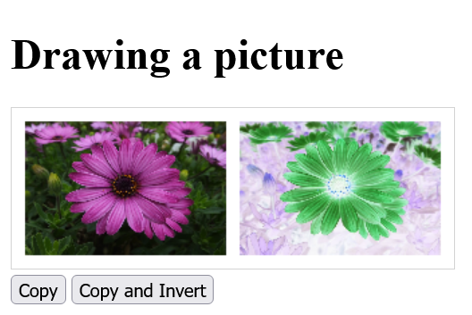

# JavaScript_Introduction-To-Web-APIs

 Introduction to Web APIs: Video and Audio API, Canvas 2D API, Geolocation API, Drag & Drop API, Offline Data, Web Workers, Server-Sent Events...

---------------------------------------------

## Content
 1. Video and audio media API
    - 1.1. Controlling video files with JavaScript and the Media API
    - 1.2. Controlling audio files with JavaScript and the Media API
 2. The Canvas 2D API
    - 2.1. Drawing on a `<canvas>` element
    - 2.2. Methods used to draw on the `<canvas>` element
    - 2.3. Copy and manipulate images with `<canvas>`
    - 2.4. Create your own functions (*wrapper*) for `<canvas>`
    - 2.5. Extending the *CanvasRenderingContext2D*
    - 2.6. Overview of ready-made `<canvas>` libraries
 3. Determine the location with the geolocation API
    - 3.1. Using the Geolocation API in an HTML Document
    - 3.2. Handle errors and access rights of the Geolocation API
    - 3.3. Fine-tuning with further options of the Geolocation API
    - 3.4. Permanently monitor the position of the user
    - 3.5. Displaying the user's position on a map
 4. Drag & Drop-API
    - 4.1. Making an HTML element `draggable`
    - 4.2. Events that can occur during drag & drop
    - 4.3. Start dragging elements
    - 4.4 Handling the data for dragging
    - 4.5. Set the place for dropping
    - 4.6. Process the dropped data
    - 4.7. Handle other events during the drag and drop process
    - 4.8. Further notes on Drag & Drop API


---------------------------------------------

# 1. Video and audio media API
Playing video and audio files is possible in HTML5 with the `<video>` and `<audio>` elements. The appearance of the controls (play, pause, volume, etc.) are predefined by the web browser and cannot be changed. But it is also possible to control media files using the JavaScript API. The advantage of custom controls for playing media files using the Media API is that the design and functionality of the player can be determined by the user and the controls can be styled using CSS or graphics.

The Media API provides a fairly large set of properties and methods. Furthermore, many event types are available, which can be used to react accordingly. 

A complete overview of all media events can be found here [HTML - Living Standard](https://html.spec.whatwg.org/multipage/media.html#mediaevents).


## 1.1. Controlling video files with JavaScript and the Media API

Example:

  [Complete Code](https://github.com/BellaMrx/JavaScript_Introduction-To-Web-APIs/tree/main/Examples/Part_1) --> **Examples/Part_1/...** 

index.html:
   ```
    <div class="video_canvas">
        <video width="640">
            <source src="video/Bugs.webm" type="video/webm">
            <source src="video/Bugs.mp4" type="video/mp4">
            Your web browser does not support video tag.
        </video>
        <p>
            <button onclick="playVideo()" id="play">Play</button>
            <button onclick="resize()" id="size">Zoom</button>
            <button onclick="control()" id="ctrl">Display controls</button>
            <button onclick="restart()">Restart</button>
            <button onclick="mute()" id="mute">Sound off</button>
        </p>
    </div>
   ```

script.js:
   ```
    let vid = document.querySelector('video');

    function playVideo() {
      let but = document.querySelector('#play');
      if (vid.paused) {
        vid.play();
        but.textContent = "--Pause--";
      } else {
        vid.pause();
        but.textContent = "Play";
      }
    }
    ...
   ```

Output:

 

In this example, some methods and properties of the JavaScript Media API are used for the `video` element. The `play()` and `pause()` methods start and pause the video respectively. The `playVideo()` function first checks whether the `paused` property is `true` or not. According to the evaluation the video is started or stopped and the label on the button changes accordingly.
With the property `width` the size of the video, in the function `resize()`, is changed. Also the fade in and fade out of the controls can be enabled or disabled at any time using the `controls` property, as seen in the `control()` function. The `currentTime` property is used to set the position of the video to a specific time in seconds. Here it has been set to `0`, which causes the video to play from the beginning.
The `muted` property controls the sound. With `false` the sound is switched off with `true` switched on. A volume control can be realized with the `volume` property, the values from `0.0` to `1.0` represent the respective volume.


## 1.2. Controlling audio files with JavaScript and the Media API
The same media API is used for the `audio` element as for the `video` element, so everything can be done that was done for the `video` element.

Example:

  [Complete Code](https://github.com/BellaMrx/JavaScript_Introduction-To-Web-APIs/tree/main/Examples/Part_2) --> **Examples/Part_2/...** 

index.html:
   ```
    <br>
    <audio>
        <source src="audio/Californication.mp3" type="audio/mpeg">
        <source src="audio/Californication.wav" type="audio/wav">
        <source src="audio/Californication.ogg" type="audio/ogg">
        This web browser does not support audio tag.
    </audio>
    <div>
        <button onclick="play()" id="play">Play</button>
        <button onclick="fast()" id="fast">2x</button>
        <button onclick="rewind()">Rewind</button>
        <button onclick="mute()" id="mute">Sound off</button>
        <button onclick="control()" id="ctrl">Display controls</button>
    </div>
   ```

script.js:
   ```
    let aud = document.querySelector('audio');
    // Pause and playback function
    function play() {
      let play = document.querySelector('#play');
      if (aud.paused) {
        aud.play();
        play.textContent = "--Pause--";
      } else {
        aud.pause();
        play.textContent = "Play";
      }
    }
    // 1x/2x speed
    function fast() {
      let play = document.querySelector('#fast');
      if (aud.playbackRate == 1.0) {
        aud.playbackRate = 2.0;
        play.textContent = "1x";
      } else {
        aud.playbackRate = 1.0;
        play.textContent = "2x";
      }
    }
    // Start audio from beginning
    function rewind() {
      aud.currentTime = 0;
    }
    // Switch sound on/off
    function mute() {
      let mtxt = document.querySelector('#mute');
      if (aud.muted) {
        aud.muted = false;
        mtxt.textContent = "Sound off";
      } else {
        aud.muted = true;
        mtxt.textContent = "Sound on";
      }
    }

    function control() {
      let ctr = document.querySelector('#ctrl');
      if (aud.controls == false) {
        aud.controls = true;
        ctr.textContent = "Hide controls";
       } else {
        aud.controls = false;
        ctr.textContent = "Display controls";
      }
    }
   ```

Output:

 


# 2. The Canvas 2D API
The HTML element `<canvas>` is initially nothing more than a white area on which to draw using JavaScript. Such an empty drawing area can be specified as follows:

  [Complete Code](https://github.com/BellaMrx/JavaScript_Introduction-To-Web-APIs/tree/main/Examples/Part_3) --> **Examples/Part_3/...** 
  
index.html:
   ```
    <body>
      <h1>Create drawing area</h1>
      <canvas id="myCanvas" width="400" height="200" style="border:1px solid #000000;">
        Your browser does not support the canvas element.
      </canvas>
    </body>
   ```

Output:

 


## 2.1. Drawing on a `<canvas>` element
The actual drawing on the `<canvas>` elements is done with JavaScript. For this, a connection to the `<canvas>` element must be established with JavaScript. This is done with the HTML attribute `id` of `<canvas>` and the DOM method `querySelector()`.

   ```
    let canvas = document.querySelector('#myCanvas');
   ```

Another connection to an interface is needed so that something can be drawn on the `canvas` surface. This interface is called a *Rendering Context* and provides the necessary methods and properties for drawing. The connection to the context object is made with `getContext()` and takes as parameter the type of the context, here it is `2d`. An object of type *CanvasRenderingContext2D* is returned. The interface is accessed with `getContext()` and the string `2d` in it.

   ```
    let canvas = document.querySelector('#myCanvas');
    let ctx = canvas.getContext("2d");
   ```

Example:

  [Complete Code](https://github.com/BellaMrx/JavaScript_Introduction-To-Web-APIs/tree/main/Examples/Part_4) --> **Examples/Part_4/...** 
  
script.js:
   ```
    let canvas = document.querySelector('#myCanvas');
    if (canvas.getContext) {
      let ctx = canvas.getContext("2d");
      // sets the color to fill the drawing
      ctx.fillStyle = "red";
      // ctx.fillRect(0, 0, 300, 150); - start point in the upper left corner 0,0, with a 300 x 150 pixel rectangle
      // the starting point is shifted by 20 pixel each (x,y)
      ctx.fillRect(20, 20, 300, 150);
    }
   ```

Output:

 


#### 3D context (WebGL)
To use the 3D context, the `getContext()` method must be given the `webgl` parameter (instead of `2d`) for a *3D rendering context* in the web browser. The object returned is of type *WebGLRenderingContext*. This is the version 1 of WebGL. Meanwhile there is a version 2, which is called with the parameter `webgl2`. This topic is very extensive and therefore I will not go into it further here.


## 2.2. Methods used to draw on the `<canvas>` element
The following example demonstrates some methods for drawing rectangles, lines, circles, and text:

  [Complete Code](https://github.com/BellaMrx/JavaScript_Introduction-To-Web-APIs/tree/main/Examples/Part_5) --> **Examples/Part_5/...** 

index.html:
   ```
    <canvas id="myCanvas" width="400" height="250" style="border:1px solid lightgrey;">
        Your browser does not support the canvas element.
    </canvas>
   ```

script.js:
   ```
    let canvas = document.querySelector('#myCanvas');
    if (canvas.getContext) {
      let ctx = canvas.getContext("2d");
      // Rectangle
      ctx.fillStyle = "lightgreen";           // color
      ctx.fillRect(20, 20, 300, 150);         // draws the shape; start point 20, 20 (x,y), rectangle 300 x 150 pixel

      // graphic with gradient
      //var grd = ctx.createLinearGradient(20, 20, 300, 150); 
      //grd.addColorStop(0, "yellow");
      //grd.addColorStop(1, "red");
      //ctx.fillStyle = grd;
      //ctx.fillRect(20,20,300,150);

      ctx.strokeRect(20, 20, 300, 150);       // draws shape as frame without filling
      ctx.clearRect(50, 50, 100, 50);         // deletes specified pixels 
      ctx.strokeRect(50, 50, 100, 50);
      // Line
      ctx.lineWidth = 10;                     // line thickness
      ctx.moveTo(400, 0);                     // moves the path to a specified point without drawing a line
      ctx.lineTo(0, 250);                     // adds a line from the last point in the path to a new point
      ctx.stroke();                           // draws the path
      // Circle
      ctx.lineWidth = 5;
      ctx.beginPath();                        // starts a path or resets the current path
      ctx.arc(320, 170, 75, 0, 2 * Math.PI);  // creates a circle or a part of a circle
      ctx.stroke();
      ctx.fillStyle = "red";                  
      ctx.fill();                             // fills the current path
      // Text
      ctx.fillStyle = "green";                
      ctx.font = "40px Arial";                // font-size, font
      ctx.fillText("canvas", 170, 50);        // draws the text
      ctx.lineWidth = 1;
      ctx.strokeText("canvas", 40, 135);      // draws text as frame without filling
    }
   ```

Output:

 

The `fillStyle()` property sets the color used with `fillRect()` or `fillText`. With `fill()` and `stroke()` there are two types of methods to draw a shape. With the `fill...()` variant the shapes are drawn with filled color, with the `stroke...()` variant only a frame is drawn in the respective color without filling.

Drawing single or multiple lines can be realized with the methods `moveTo()`, `lineTo()` and `stroke()`. With `moveTo(x, y)` the imaginary drawing pen is set at a certain position and with `lineTo()` the end point of the line is determined and with `stroke()` the line is drawn afterwards. With `lineWidth()` the thickness of the line is set.

To draw a circle the method `arc()` can be used. The path is created with `beginPath` and with `arc()` the circle is drawn. The `fill` and `stroke` variants cannot be used here for drawing, but for filling with color or setting a frame these methods can be used.

Text is drawn with either `fillText()` or `strokeText()`. The font or size is set with the `font` property.


## 2.3. Copy and manipulate images with `<canvas>`
With the method `drawImage()` it is possible to output images to a `canvas` element. The bitmaps can be read with the method `getImageData()`, and then you have full access to the pixels by traversing pixel by pixel in an array and thus it is possible to manipulate this image. If, on the other hand, pixels are to be drawn on a `canvas` element, this can be done with the `putImageData()` method.

  [Complete Code](https://github.com/BellaMrx/JavaScript_Introduction-To-Web-APIs/tree/main/Examples/Part_6) --> **Examples/Part_6/...** 

index.html:
   ```
    <body>
      <h1>Drawing a picture</h1>
      <canvas id="myCanvas" width="330" height="120" style="border:1px solid lightgrey;">
        Your browser does not support the canvas element.
      </canvas>
      <br>
      <button onclick="copy()">Copy</button>
      <button onclick="copy_invert()">Copy and Invert</button>
      <script src="script.js"></script>
    </body>
   ```

script.js:
   ```
   let canvas = document.querySelector('#myCanvas');
   if (canvas.getContext) {
      let ctx = canvas.getContext("2d");
      let img = new Image();
      img.src = "images/flower_960.jpg";
      img.onload = function() {
        ctx.drawImage(img, 10, 10, 150, 100);
      };

      function copy() {
        let imgData = ctx.getImageData(10, 10, 150, 100);
        ctx.putImageData(imgData, 170, 10);
      }

      function copy_invert() {
        let imgData = ctx.getImageData(10, 10, 150, 100);
        let i = 0;
        while (i < imgData.data.length) {
            imgData.data[i] = 255 - imgData.data[i++];
            imgData.data[i] = 255 - imgData.data[i++];
            imgData.data[i] = 255 - imgData.data[i++];
            imgData.data[i] = imgData.data[i++];
        }
        ctx.putImageData(imgData, 170, 10);
      }
    }
   ```

Output:

 

This is a general algorithm for manipulating images, like other image editors use to invert images. In this and similar ways a lot of effects can be created. The image object can also be used from an `img` element in the document.

#### *Uncaught SecurityError*
Since it is possible to read parts of the image with the `getImageData()` method, it may happen that the error *Uncaught SecurityError* is returned in the JavaScript console. This is the case, for example, if the `getImageData()` method is used on the local computer. For it to work, the image must be on the same domain as the code.


## 2.4. Create your own functions (*wrapper*) for `<canvas>`
Since functions for circles and polygons are missing, it makes sense to pack this application order with the 2D rendering context into functions and these can then be easily called when creating the desired shape.

Here is an example of a collection of such functions, in JavaScript:

  [Complete Code](https://github.com/BellaMrx/JavaScript_Introduction-To-Web-APIs/tree/main/Examples/Part_7) --> **Examples/Part_7/...**

canvasFunc.js:
   ```
    /* Canvas help functions          */
    function fillCircle(context, cx, cy, r) {
      context.beginPath();
      context.arc(cx, cy, r, 0, 2*Math.PI);
      context.fill();
      context.closePath();
    }
  
    function strokeCircle(context, cx, cy, r) {
      context.beginPath();
      context.arc(cx, cy, r, 0, 2*Math.PI);
      context.stroke();
      context.closePath();
    }
 
    function fillPolygon(context, points) {
      xy = points.split(" "); 
      context.beginPath();
      if(xy.length > 0) {
        // determine start end point
        start_end = xy[0].split(",");
        context.moveTo(start_end[0], start_end[1]);
      }
      // run through individual points
      for( i=1;  i< xy.length; i++) {
        xyN = xy[i].split(",");
        context.lineTo(xyN[0], xyN[1]);
      }
      context.lineTo(start_end[0], start_end[1]);
      context.fill();
      context.closePath();
    }
  
    function strokePolygon(context, points) {
      xy = points.split(" "); 
      context.beginPath();
      if(xy.length > 0) {
        // determine start end point
        start_end = xy[0].split(",");
        context.moveTo(start_end[0], start_end[1]);
      }
      // run through individual points
      for( i=1;  i< xy.length; i++) {
        xyN = xy[i].split(",");
        context.lineTo(xyN[0], xyN[1]);
      }
      context.lineTo(start_end[0], start_end[1]);
      context.stroke();
      context.closePath();
    }
   ```

This script **canvasFunc.js** with the functions, for the circle and the polygon, must be included in the HTML document together with **draw.js**, which contains the main instructions.

index.html:
   ```
    <body>
      <h1>Canvas extension functions</h1>
      <canvas id="myCanvas" width="300" height="300" style="border:1px solid lightgrey;">
        Your browser does not support the canvas element.
      </canvas>
      <script src="canvasFunc.js"></script>
      <script src="draw.js"></script>
    </body>
   ```

draw.js:
   ```
    let canvas = document.querySelector('#myCanvas');
    if (canvas.getContext) {
      let ctx = canvas.getContext("2d");
      ctx.fillStyle = "green";
      fillCircle(ctx, 150, 150, 100);
      ctx.lineWidth = 3;
      strokeCircle(ctx, 150, 150, 100);
      strokeCircle(ctx, 30, 30, 20);
      strokeCircle(ctx, 30, 270, 20);
      strokeCircle(ctx, 270, 30, 20);
      strokeCircle(ctx, 270, 270, 20);
      ctx.lineWidth = 1;
      strokeCircle(ctx, 150, 150, 120);
      ctx.lineWidth = 3;
      ctx.fillStyle = "lightgreen";
      fillPolygon(ctx, points = "150,280 270,100 30,100");
      strokePolygon(ctx, points = "150,280 270,100 30,100");
    }
   ```

Output:

 


## 2.5. Extending the *CanvasRenderingContext2D*
In section 2.4. it was shown how the *2D rendering context* can be used to access a `canvas` element with auxiliary functions in a simplified way. However, this is still relatively cumbersome because global function calls have to be used.

Draw a frame around a circle with the help function:

  ```
   ctx.lineWidth = 3;
   strokeCircle(ctx, 150, 150, 100);  
  ```

However, the same looks a bit better with the already implemented `strokeRect()` method, because dr *2D-Context* does not have to be passed as a function parameter:

  ```
   ctx.lineWidth = 3;
   ctx.strokeRect(20, 20, 300, 150);  
  ```

It would be better, more consistent and more logical to use the self-written helper function `strokeCircle()` like this:

  ```
   ctx.strokeCircle(150, 150, 100);  
  ```

To retrofit something like this you only have to extend the prototype in `CanvasRenderingContext2D.prototype.name` with the corresponding method:

  [Complete Code](https://github.com/BellaMrx/JavaScript_Introduction-To-Web-APIs/tree/main/Examples/Part_8) --> **Examples/Part_8/...** 

canvasExt.js:
  ```
   /* Canvas extension         */
   CanvasRenderingContext2D.prototype.fillCircle = function(cx, cy, r) {
     this.beginPath();
     this.arc(cx, cy, r, 0, 2*Math.PI);
     this.fill();
     this.closePath();
   }
  
   CanvasRenderingContext2D.prototype.strokeCircle = function(cx, cy, r) {
     this.beginPath();
     this.arc(cx, cy, r, 0, 2*Math.PI);
     this.stroke();
     this.closePath();
   }
  
   CanvasRenderingContext2D.prototype.fillPolygon = function(points) {
     xy = points.split(" "); 
     this.beginPath();
     if(xy.length > 0) {
      // determine start end point
      start_end = xy[0].split(",");
      this.moveTo(start_end[0], start_end[1]);
     }
     // run through single points
     for( i=1;  i< xy.length; i++) {
       xyN = xy[i].split(",");
       this.lineTo(xyN[0], xyN[1]);
     }
     this.lineTo(start_end[0], start_end[1]);
     this.fill();
     this.closePath();
   }
  
   CanvasRenderingContext2D.prototype.strokePolygon = function(points) {
     xy = points.split(" "); 
     this.beginPath();
     if(xy.length > 0) {
      // determine start end point
      start_end = xy[0].split(",");
      this.moveTo(start_end[0], start_end[1]);
     }
     // run through single points
     for( i=1;  i< xy.length; i++) {
       xyN = xy[i].split(",");
       this.lineTo(xyN[0], xyN[1]);
     }
     this.lineTo(start_end[0], start_end[1]);
     this.stroke();
     this.closePath();
   }
  ```

After the prototype has been extended, these new methods can be used with the Context object:

draw.js:
  ```
   let canvas = document.querySelector('#myCanvas');
   if (canvas.getContext) {
     let ctx = canvas.getContext("2d");
     ctx.fillStyle = "red";
     ctx.fillCircle(150, 150, 100);
     ctx.lineWidth = 3;
     ctx.strokeCircle(150, 150, 100);
     ctx.strokeCircle(30, 30, 20);
     ctx.strokeCircle(30, 270, 20);
     ctx.strokeCircle(270, 30, 20);
     ctx.strokeCircle(270, 270, 20);
     ctx.lineWidth = 1;
     ctx.strokeCircle(150, 150, 120);
     ctx.lineWidth = 3;
     ctx.fillStyle = "blue";
     ctx.fillPolygon(points = "150,280 270,100 30,100");
     ctx.strokePolygon(points = "150,280 270,100 30,100");
   }
  ```

Output:

 


## 2.6. Overview of ready-made `<canvas>` libraries
The selection of ready-made `<canvas>` libraries is impressive. Many of these ready-made APIs use only JavaScript, and you don't need an extension anymore. Canvas APIs exist for different purposes, for drawing shapes, graphs or animations. Of course, you can also write your own libraries.

Such libraries or frameworks package the functionalities so that they can be reused with a simpler syntax.

 - [Paper.js](http://paperjs.org) - vector graphics scripting with good documentation
 - [EaselJS](https://createjs.com/) - The functinality of this API is huge, similar to *Flash*.
 - [Camanjs](http://camanjs.com) - Specialist in pixel manipulation(image editing).
 
Of course there are a lot of more good APIs out there, but these should be enough to get you started.


# 3. Determine the location with the geolocation API
The Geolocation API can be used to determine the visitor's location, which works with almost everything modern web browsers. The browser can use several methods for this, such as the IP address, the WLAN connection, the cell tower the smartphone is connected to, and the position via GPS transmitter, as long as it is supported by the hardware. If a device contains a GPS transmitter, the geolocation API theoretically works offline as well.

How the determination works also depends on the device used. For a local desktop computer, which is not equipped with a GPS transmitter or a mobile modem, the accuracy of the position by IP address can vary quite a bit (depending on the provider). In a rural region, for example, the determination of the location with a mobile device is usually accurate to the meter.

#### Privacy and security
Determining the location of a user is quite easy nowadays. However, it is not possible to locate visitors to a website to the nearest meter. You can't get location data without the explicit consent of the visitor. In most web browsers there is a query. How the web browser stores this consent or refusal varies, but can be reversed at any time.

 

More information about the security rules and the Geolocation API can be found here [W3C](https://w3c.github.io/geolocation-api/).


## 3.1. Using the Geolocation API in an HTML Document 
To be able to use the Geolocation API, you must first check whether it is supported:

  [Complete Code](https://github.com/BellaMrx/JavaScript_Introduction-To-Web-APIs/tree/main/Examples/Part_9) --> **Examples/Part_9/...** 

index.html:
  ```
   <body>
     <h1>Using Geolocation API</h1>
     <p>Click to determine your position.</p>
     <button onclick="getmyLocation()">Determine position</button>
     <p class="output"></p>
     <script src="script.js"></script>
   </body>
  ```

script.js:
  ```
   let x = document.querySelector('.output');

   function getmyLocation() {
     if (navigator.geolocation) {
        navigator.geolocation.getCurrentPosition(showPosition);
     } else {
        x.innerHTML = "Your web browser does not support the Geolocation API!";
     }
   }

   function showPosition(position) {
     let pos = "Latitude: " + position.coords.latitude;
     pos += "<br>Longitude: " + position.coords.longitude;
     x.innerHTML = pos;
   }
  ```

Output:

 

When the button is clicked, the function `geMyLocation()` is called, where first it is checked if `navigator.geolocation` is equal to `true` and thus the API can be used. Then the `getCurrentPosition()` method of the API starts. On first use, the user's consent should be obtained. If consent is given and the `getCurrentPosition()` method is executed successfully, a coordinate object is returned which is passed as a parameter to the callback function set up here with `showPosition()`. This coordinate object is used in the `showPosition` callback function to output the determined data (latitude, longitude).

There are more properties than `coords.latitude` and `coords.longitude`:

| Property                  | Description                             |
| ------------------------- | --------------------------------------- |
| `coords.latidude`         | Geographic latitude                     |
| `coords.longitude`        | Geographic longitude                    |
| `coords.accuracy`         | Precision of width and length in meters |
| `coords.altitude`         | Height in meters                        |
| `coords.altitudeAccuracy` | Precision of the height in meters       |
| `coords.heading`          | Direction                               |
| `coords.speed`            | Speed                                   |
| `timestamp`               | Timestamp of the request                |


## 3.2. Handle errors and access rights of the Geolocation API
If the Geolocation API is used, one should set up a function for errors, so that the user knows why a location detection did not work. The function only needs to be passed as the second parameter of the `getCurrentPosition()` method:

  [Complete Code](https://github.com/BellaMrx/JavaScript_Introduction-To-Web-APIs/tree/main/Examples/Part_10) --> **Examples/Part_10/...** 

index.html:
  ```
   <body>
     <h1>Geolocation API - error handling</h1>
     <p>Click to determine your position.</p>
     <button onclick="getmyLocation()">Determine position</button>
     <p class="output"></p>
     <script src="script.js"></script>
   </body>
  ```

script.js:
  ```
   let x = document.querySelector('.output');

   function getmyLocation() {
     if (navigator.geolocation) {
        navigator.geolocation.getCurrentPosition(showPosition, showError);
     } else {
        x.innerHTML = "Your web browser does not support the Geolocation API!";
     }
   }

   function showPosition(position) {
     let pos = "Latitude: " + position.coords.latitude;
     pos += "<br>Londitude: " + position.coords.longitude;
     x.innerHTML = pos;
   }

   function showError(error) {
     if (error.PERMISSION_DENIED) {
        x.innerHTML = "Access to your position has been denied!? Blocked?"
     } else if (error.POSITION_UNAVAILABLE) {
        x.innerHTML = "There are no geoposition data available"
     } else if (error.TIMEOUT) {
        x.innerHTML = "Timeout on location request was triggered."
     } else {
        x.innerHTML = "An unknown error has occurred";
     }
   }
  ```

Output:

 

Depending on whether an error occurred and which error occurred, the result will be output on the website. 

Possible errors and their meaning:
| Error                  | Meaning                                                                              |
| ---------------------- | ------------------------------------------------------------------------------------ |
| `PERMISSION_DENIED`    | Access denied. User has probably denied permission to determine position.            |
| `POSITION_UNAVAILABLE` | The position could not be determined.                                                |
| `TIMEOUT`              | The query of the position took too long and could not be done within a certain time. |


## 3.3. Fine-tuning with further options of the Geolocation API
The method `getCurrentPosition()` can take a third optional parameter with an object of type `PositionOptions`:

  [Complete Code](https://github.com/BellaMrx/JavaScript_Introduction-To-Web-APIs/tree/main/Examples/Part_11) --> **Examples/Part_11/...** 

index.html:
  ```
   <body>
     <h1>Geolocation API - fine tuning</h1>
     <p>Click to determine your position.</p>
     <button onclick="getmyLocation()">Determine position</button>
     <p class="output"></p>
     <script src="script.js"></script>
   </body>
  ```

script.js:
  ```
   let x = document.querySelector('.output');

   function getmyLocation() {
     if (navigator.geolocation) {
        let geo_options = {
            enableHighAccuracy: true,
            maximumAge: 30000,
            timeout: 27000
        };
        navigator.geolocation.getCurrentPosition(showPosition, showError, geo_options);
     } else {
        x.innerHTML = "Your web browser does not support the Geolocation API!";
     }
   }
   ...
  ```

Here with `enableHighAccuracy`, `maximumAge` and `timeout` all three existing properties of the `PositionOptions` object are used.

| Property             | Description |
| -------------------- | -------------- |
| `enableHighAccuracy` | With `true` the API is forced to determine the position even more precisely. |
| `maximumAge`         | This specifies how long a cached location data may be used the next time `getCurrentPosition()` is called. If `0` is specified, no cached data will be used, and the current position is always required. |
| `timeout`            | This specifies a time in milliseconds after which an error (`TIMEOUT`) is to be triggered if no data could be retrieved by then. |

  ```
   ...
   let geo_options = {
     enableHighAccuracy: true,
     maximumAge: 30000,
     timeout: 27000
   };
   ...
  ```

Here `enableHighAccuracy: true` was used to enable the highest possible location determination. If the last location was determined with `getCurrentPosition()` within 30 seconds, a cached location may be used, which was specified with `maximumAge: 30000`. If the location determination takes longer than 27 seconds, a timeout due to the timeout is returned as an error (`timeout:27000`).


## 3.4. Permanently monitor the position of the user
Permanent monitoring of the user's position is possible with the `watchPosition()` method, which has the same structure as `getCurrentPosition()`. The first parameter is a callback function which should be called on success to evaluate the position data. Optionally, a callback function can be set as the second parameter, which will be called in case of an error. Also optional can be used as parameter is the `PositionObject` object.
In contrast to the method `getCurrentPosition()` the method `watchPosition()` calls the callback function every time the position of the user changes. Additionally, this method returns an ID that can be passed to the `clearWatch()` method as a parameter to stop the `watchPosition()` method again.

To better test the following example, a device with a GPS transmitter is required:

  [Complete Code](https://github.com/BellaMrx/JavaScript_Introduction-To-Web-APIs/tree/main/Examples/Part_12) --> **Examples/Part_12/...** 

index.html:
  ```
   <body>
     <h1>Geolocation API - Position monitoring</h1>
     <p>Click to determine your position.</p>
     <button onclick="getmyLocation()">Determine position</button>
     <button onclick="endmyLocation()">End monitoring</button>
     <p class="output"></p>
     <script src="script.js"></script>
   </body>
  ```

script.js:
  ```
   let x = document.querySelector('.output');
   let id;

   function getmyLocation() {
     if (navigator.geolocation) {
        let geo_options = {
            enableHighAccuracy: true,
            maximumAge: 30000,
            timeout: 27000
        };
        id = navigator.geolocation.watchPosition(showPosition, showError, geo_options);
     } else {
        x.innerHTML = "Your web browser does not support the Geolocation API!";
     }
   }

   function showPosition(position) {...}

   function showError(error) {...}

   function endmyLocation() {
     if (navigator.geolocation) {
        navigator.geolocation.clearWatch(id);
        x.innerHTML = "Position monitoring finished";
     } else {
        x.innerHTML = "The web browser does not support geolocation API!";
     }
   }
  ```

 


## 3.5. Displaying the user's position on a map
With the information about the geographical longitude and latitude, you have all the necessary data to display the location on a map. This requires an API for a map provider.

Unlike in the examples before, the callback function `showPosition()` has to be adapted to display the detected location in a map. In the following example, the `showPositionGoogle()` and `showPositionBing()` callback functions were used to display the location in the Google and Bing map:

  [Complete Code](https://github.com/BellaMrx/JavaScript_Introduction-To-Web-APIs/tree/main/Examples/Part_13) --> **Examples/Part_13/...** 

index.html:
  ```
   ...
      <!-- For Google Maps -->
      <script src="http://maps.google.com/maps/api/js?sensor=true"></script>
      <!-- For Bing Maps -->
      <script type="text/javascript" src="http://ecn.dev.virtualearth.net/mapcontrol/mapcontrol.ashx?v=7.0"></script>
   </head>
   <body>
      <h1>Geolocation API - show position on map</h1>
      <p>Click to view your position on a map.</p>
      <p>
        <button onclick="getmyLocation('google')">Google-Map</button>
        <button onclick="getmyLocation('bing')">Bing-Map</button>
        <button onclick="endmyLocation()">End monitoring</button>
      </p>
      <div class="output"></div>
      <script src="script.js"></script>
   </body>
  ```

script.js:
  ```
   let x = document.querySelector('.output');
   let id = null;
   let geo_options = {
     enableHighAccuracy: true,
     maximumAge: 30000,
     timeout: 27000
   };

   function getmyLocation(str) {
     if (navigator.geolocation) {
        if (id != null) {
            navigator.geolocation.clearWatch(id);
        }
        if (str == "google") {
            id = navigator.geolocation.watchPosition(
                showPositionGoogle, showError, geo_options);
        } else if (str == "bing") {
            id = navigator.geolocation.watchPosition(
                showPositionBing, showError, geo_options);
        }
     } else {
        x.innerHTML = "The web browser does not support geolocation API!";
     }
   }

   // Show position with Google Maps
   function showPositionGoogle(position) {
     let latlng = new google.maps.LatLng(
        position.coords.latitude,
        position.coords.longitude);
     let myOptions = {
        zoom: 12,
        center: latlng,
        mapTypeId: google.maps.MapTypeId.ROADMAP
     };
     let map = new google.maps.Map(x, myOptions);

     let marker = new google.maps.Marker({
        position: latlng,
        map: map,
        title: "Your position"
     });
   }
   // Show position withBing Maps
   function showPositionBing(position) {
     let latlng = new Microsoft.Maps.Location(position.coords.latitude, position.coords.longitude);
     let myOptions = {
        credentials: "AoDa4otH86aw2VF_Te1WpuxyGlI4-sUV3ZSIDxEWnGXAj62fmgvd2CZxFr82dqFE",
        center: latlng,
        mapTypeId: Microsoft.Maps.MapTypeId.road,
        zoom: 14
     };
     let map = new Microsoft.Maps.Map(x, myOptions);
   }
   ...
  ```

 

First, the *Google Maps API* and the *Bing Maps AJAX Control* were embedded. The size for the map is shown in the `div`- element. 
When a button is clicked, the function `getMyLocation()` determines which button was clicked after checking if the Geolocation API is available. This was realized here with the string `google` or `bing`, which is passed to the function `getMyLocation(str)` when clicking. Depending on which map is to be used, the `watchPosition()` method is passed the callback function `showPositionGoogle()` or `showPositionBing()` as the second parameter.

Apart from the properties determined with the geolocation API (`position.coords.latitude` and `position.coords.longitude`), the methods, objects and options contained in `showPositionGoogle()` and `showPositionBing()` are pure *Google Maps API* or *Bing Maps AJAX Control* specifications, which have nothing more to do with the geolocation API. 

More information about the *Google Maps API* and *Bing Maps AJAX Control*:
 - [Google Maps API](https://mapsplatform.google.com/)
 - [Bing Maps AJAX Control](https://learn.microsoft.com/en-us/bingmaps/v8-web-control/)

#### `sensor` parameter on *Google-Maps-API* set to `true` or `false`?
In the example, the `sensor` parameter has been set to `true` (`<script src="http://maps.google.com/maps/api/js?sensor=true"></script>`) because it makes the positioning more accurate if the device contains a GPS transmitter. For a local computer, it can be set to `false` if there is no GPS transmitter.


# 4. Drag & Drop-API
Drag & Drop has been implemented over the years with libraries like [JQuery](http://jquery.com), [Dojo](http://dojotoolkit.org) or [MooTools](http://mootools.net) to drag an object from one position to another in the web browser with the mouse button held down. With the Drag & Drop API, *Drag & Drop native* can be used without any further library. However, using the *native Drag & Drop API* is more complex than the solution with jQuery, Dojo or MooTools.


## 4.1. Making an HTML element `draggable`
To make an HTML element draggable, the HTML attribute `draggable` can be used. The attribute is passed either the value `true` or `false`. With `true` the HTML element is marked as draggable and with `false` not:

  ```
   
  ```
Theoretically, `draggable="true"` can be omitted from the `` element, because some HTML elements are already drawable by default like `` or `<a>` with the `href` attribute.


## 4.2. Events that can occur during drag & drop

| JavaScript Event | Description |
| ---------------- | -------------- |
| `dragstart`      | Fired when the user starts dragging an HTML element with the mouse button held down. After the `dragstart` event, a function is usually called that takes care of the data associated with that element. |
| `dragenter`      | Fired when the mouse makes the first move when dragging over an HTML element. This event is useful if something needs to be styled visually when the user starts dragging an HTML element. |
| `dragover`       | The event is triggered when a draggable element stands over another element. |
| `dragleave`      | The event is triggered when the dragged element leaves another HTML element. In practice, this event can be used to remove a visual highlight from a drop area. |
| `drag`           | The event is fired whenever an HTML element is moved with the mouse button held down. |
| `drop`           | The `drop` event is fired when an element is dropped over another element that was a valid drop target. Here, the usual response is to take care of the dropped data and insert it into the drop area. |
| `dragend`        | This event is triggered when the drag & drop is finished. | 


## 4.3. Start dragging elements
After setting an element with the `draggable` attribute to `true` to be able to drag it, an event handler can be set up for the `dragstart` event, where m will take care of the data that is being dragged:

  ```
   
  ```


## 4.4 Handling the data for dragging
When the user starts dragging the image, the `dragstart` event is fired, and the `dragHandle(event)` event handler is called where the data to drag is specified. For this purpose, each drag event has a `dataTransfer` object that is used to manage the data to be dragged:

  ```
   ...
   function dragHandle(e) {
    ...
    e.dataTransfer.setData("text", e.target.id);
    e.dataTransfer.effectAllowed = "move";
   }
   ...
  ```

The `setData()` method is used to specify the data to be transported. The first parameter is used to specify the data to be transferred with `"text"`, which corresponds to the *MIME type* `"text/plain"`. Other *MIME types* can also be used for the type of the first parameter. The second parameter specifies the data itself. You can get to this data using the `id`.
With `effectAllowed` a visual annotation can be added to the drag operation for the user (`move`). Besides the `move` value used here for a restriction to dragging, `none`, `copy`, `copyLink`, `copyMove`, `link`, `linkMove`, `move` and `all` can also be used. How the webbrowsr displays it depends on the browser.


#### Show own icon when dragging
The `setDragImage()` method of the `dataTransfer` object can be used to set a custom icon for dragging.


## 4.5. Set the place for dropping
The `dragover` event defines where an element can be dropped. By default, data or elements cannot be dropped on other elements. To allow dropping on an element, the default behavior of the element must be prevented. This is achieved by using `event.preventDefault()` to respond to the occurrence of the `dragover` event.

  ```
   <div id="dropplace1" ondragover="event.preventDefault()"></div>
  ```

An element can now be dropped onto this `div` element.


## 4.6. Process the dropped data
After preventing the default behavior of the `dragover` event, an event handler can be set up for the `drop` event when the element has been dropped. In the function where the `drop` event was handled, the dropped data can be taken care of right away.

index.html
  ```
   <div id="dropplace1" ondrop="dropHanlde(event)" ondragover="event.preventDefault()"></div>
  ```

script.js
  ```
   function dropHandle(e) {
    e.preventDefault();
    let data = e.dataTransfer.getData("Text");
    let theDraggedElement = document.getElementById(data);
    e.target.appendChild(theDraggedElement);
   }
  ```

In the function `dropHandle(e)` a default behavior must be prevented again with `e.preventDefault()`, otherwise e.g. after dropping an element, if it is e.g. a link this would be opened in the web browser.
With the `getData()` method of the `dataTransfer` object the dropped data can be retrieved based on the `MIME type`. In `data` you can only find the `id` of the dropped element at the moment, but with `getElementById()` the complete HTML element is fetched to this `ìd` and passed with `appendChild()` as a new child element inside the drop area.


## 4.7. Handle other events during the drag and drop process
Additional visual cues or information for the user can be presented with the `dragenter`, `dragleave` and `dragend` events:

  ```
   ...
   document.addEventListener("dragenter", function(event) {
     let theData = event.dataTransfer.getData("Text");
     let theDraggedElement = document.getElementById(theData);
     theDraggedElement.style.opacity = 0.0;
   }, false);

  document.addEventListener("dragend", function(event) {
     event.target.style.opacity = "";
   }, false);
   ...
  ```

Here, once the `dragenter` event has occurred, the original location of the dragged HTML element is displayed as invisible (`opacity = 0.0`). As soon as this action is finished and the `dragenter` event is fired, the element will be displayed completely visible again.
The third parameter of `addEventListener()` is used to determine if and in which order the event will rise. A boolean parameter is expected as value. By default `false` is mostly used here, which calls the event handler of the element first and then the event handlers of the parent elements. With `true` it is the other way around.


### The complete example in the overview

  [Complete Code](https://github.com/BellaMrx/JavaScript_Introduction-To-Web-APIs/tree/main/Examples/Part_14) --> **Examples/Part_14/...** 

index.html:
  ```
    <h1>Drag and Drop</h1>
    <p>Drag the squares with letters into the gray boxes.</p>
    <div id="drag-elements">
        
        
        
        
    </div>
    <div id="drop-elements">
        <div id="dropplace1" ondrop="dropHandle(event);" ondragover="dragoverHandle(event);" ondragleave="dragleaveHandle(event);">
        </div>
        <div id="dropplace2" ondrop="dropHandle(event);" ondragover="dragoverHandle(event);" ondragleave="dragleaveHandle(event);">
        </div>
        <div id="dropplace3" ondrop="dropHandle(event);" ondragover="dragoverHandle(event);" ondragleave="dragleaveHandle(event);">
        </div>
        <div id="dropplace4" ondrop="dropHandle(event);" ondragover="dragoverHandle(event);" ondragleave="dragleaveHandle(event);">
        </div>
    </div>
    <!-- Output of information -->
    <div id="log-dnd" style="clear: both;"></div>
    <script src="dnd.js"></script>
  ```

script.js:
  ```
   // Output of information
   let log = document.getElementById("log-dnd");
   let counter = 0;
   const maxPictures = 4;

   // Called when 'drag' was started
   function dragHandle(e) {
     log.innerHTML = "An element is drawn."
        // What to 'pull
     e.dataTransfer.setData("Text", e.target.id);
     e.dataTransfer.effectAllowed = 'move';
     // Own icon that is displayed when dragging
     let dragIcon = document.createElement('img');
     dragIcon.src = "images/logo.png";
     dragIcon.widh = 50;
     e.dataTransfer.setDragImage(dragIcon, -5, -5);
   }

   // Function is called at 'drop'
   function dropHandle(e) {
     if (!e.target.hasChildNodes()) {
        log.innerHTML = "Operation canceled: There is already an element here.";
        e.preventDefault();
        return false;
     }
     // A reference to the 'drag' element
     let data = e.dataTransfer.getData("Text");
     // Get the element
     let draggedElement = document.getElementById(data);

     // log.innerHTML = data + "/" + e.target.id;
     console.log(data + "/" + e.target.id);

     // Add the element to the drop element
     e.target.appendChild(draggedElement);
     // Allow the browser to 'drop'
     e.preventDefault();
     counter++;
     if (counter == maxPictures) {
        log.innerHTML = "All elements were dropped."
     } else {
        log.innerHTML = "Element " + counter + " from " + maxPictures +
            " was dropped."
     }
   }

   // Function is called with dragged element over the target
   function dragoverHandle(e) {
     e.preventDefault();
     if (!e.target.hasChildNodes()) {
        log.innerHTML = "Here already lies an element.";
     } else {
        log.innerHTML = "You can drop the element here.";
     }
   }

   // Function is called when the dragged
   // Element has left the target area again
   function dragleaveHandle(e) {
     e.preventDefault();
     log.innerHTML = "Target area was left again";
   }

   document.addEventListener("dragenter", function(event) {
     let theData = event.dataTransfer.getData("Text");
     let theDraggedElement = document.getElementById(theData);
     theDraggedElement.style.opacity = 0.0;
   }, false);

   document.addEventListener("dragend", function(event) {
     event.target.style.opacity = "";
   }, false);
  ```

  


## 4.8. Further notes on Drag & Drop API
Dragging elements outside the web browser is no longer possible with `dataTransfer.getData()`. However, this data is then contained in the `files` property of `dataTransfer`. To realize this data transfer e.g. for an upload of data via drag & drop, a detailed knowledge about the File API is necessary. More information can be found here [W3C](https://www.w3.org/TR/FileAPI/).


# 5.


